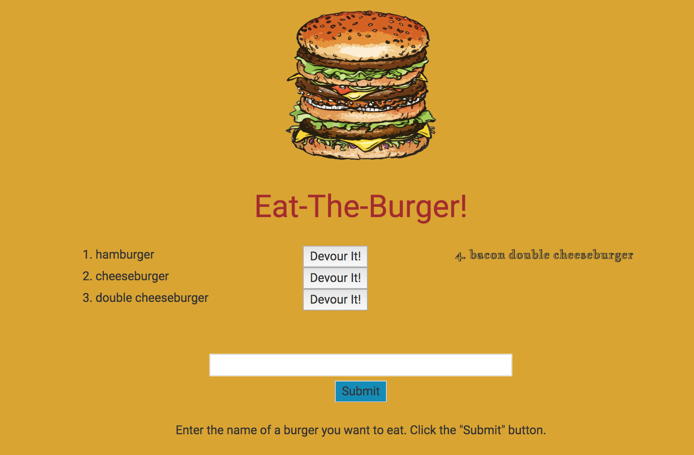

# burger
Class exercise: burger restaurant  

A MySQL application using Handlebars  
I was able to combine Handlebars and Bootstrap for the front end. Used the #if and #unless as well as the #each commands.  

Here's how it works:   
1. Enter the name of a burger in the input field. Click on the "submit" button.  
2. The name of the burger is added at the left side of the screen, along with a "devour" button.  
3. When the "devour" button is clicked, that burger's name is transferred to the right side of the screen.   
  

